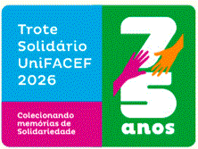

# Gabriel Belarmino Martins | Portfólio de Projetos

  
  
  
  
  

---

## 👨‍💻 Sobre mim

Sou estudante de desenvolvimento web com foco em construção de projetos práticos e organização de portfólio técnico.  
Busco demonstrar evolução contínua em lógica de programação, estruturação de código e desenvolvimento de interfaces.

Este repositório representa minha evolução prática, reunindo projetos acadêmicos e aplicações desenvolvidas com foco em clareza, organização e aplicação real.

---

## 🌐 Acesse o projeto online

🔗 https://gabsaatechlab.github.io/trote-solidario-2026/

---

## 🎥 Demonstração do projeto

---

## 📁 Estrutura do projeto

- `index.html` → página principal do portfólio  
- `styles.css` → identidade visual  
- `projetos/trote-unifacef/` → projeto web completo  
- `projetos/portugol/` → exercícios de lógica  

---

## ⭐ Projetos em destaque (Cases)

### 🏆 Trote Solidário UniFACEF 2026

**Contexto:**  
Projeto desenvolvido com base em um evento real, com o objetivo de apresentar informações, regras e dinâmica da atividade.

**Solução desenvolvida:**  
Criação de um site multipágina com navegação estruturada, organização visual e funcionalidades interativas.

**Principais funcionalidades:**
- Navegação entre páginas  
- Página institucional  
- Calculadora de pontos  
- Contador regressivo  

**Tecnologias utilizadas:**  
HTML5, CSS3, JavaScript  

📍 `projetos/trote-unifacef/Trote-UniFACEF-Oficial.html`

---

### 💻 Exercícios em Portugol

**Contexto:**  
Prática de lógica de programação com foco em desenvolvimento progressivo.

**Solução desenvolvida:**  
Coleção de exercícios organizados em trilha de aprendizado, com aumento gradual de complexidade.

**Principais abordagens:**
- Cálculos matemáticos  
- Conversões  
- Manipulação de variáveis  
- Problemas aplicados  

**Destaque:**  
Exercício final com simulação de orçamento de materiais de construção.

📍 `projetos/portugol/index.html`

---

## 📚 Aprendizados

- Organização de projetos em estrutura profissional  
- Separação de responsabilidades (HTML, CSS, JS)  
- Construção de interfaces com foco em usabilidade  
- Aplicação de lógica de programação em cenários reais  
- Uso do Git e GitHub para versionamento e portfólio  

---

## 🔧 Próximos passos

- Melhorar responsividade (mobile-first)  
- Adicionar novos projetos práticos  
- Refinar design e experiência do usuário  
- Evoluir a complexidade das aplicações JavaScript  
- Implementar boas práticas de código e padronização  

---

## 🎯 Objetivo

Transformar este GitHub em uma vitrine profissional, demonstrando evolução técnica, organização e capacidade de desenvolvimento para oportunidades na área de tecnologia.

---

## 👨‍💻 Autor

**Gabriel Belarmino Martins**  
🔗 https://github.com/gabsaatechlab  
📧 gabrielmartins160108@gmail.com  
